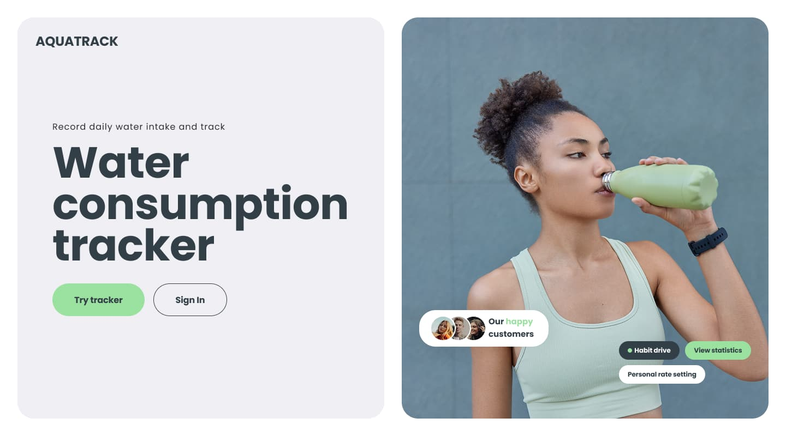
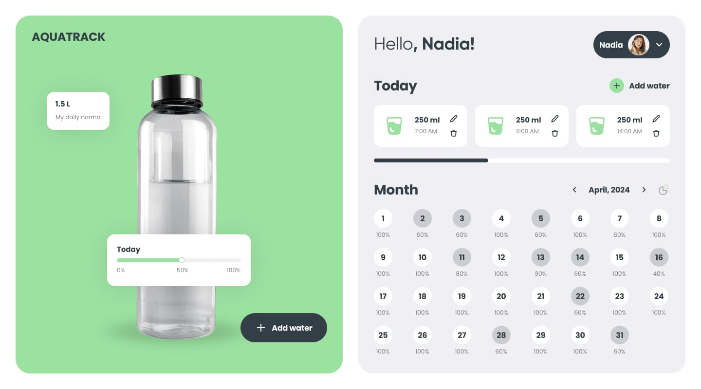

# AquaTrack 🌊

**AquaTrack** is a web application designed to track water intake and maintain a healthy lifestyle.





## 🚀 Features

- 💧 User registration and authentication
- 📊 Daily water intake tracking
- 📅 Water consumption history
- 🌍 Multi-language support (i18next)
- 🏆 Gamification and statistics
- 🎓 Interactive onboarding tour for new users

## 📦 Technologies Used

- **Frontend**: React, Redux Toolkit, Vite
- **UI**: MUI, Framer Motion, Chart.js
- **API**: Axios
- **Forms**: React Hook Form, Yup
- **Multi-language**: i18next
- **Interactive Tour**: @reactour/tour

## 🛠 Local Setup

1. **Clone the repository**

   ```bash
   git clone https://github.com/Serhii-Briushyn/aqua-track-frontend.git
   cd aqua-track-frontend
   ```

2. **Install dependencies**

```bash
   npm install
```

3. **Start the project**

```bash
   npm run dev
```

## 👥 Authors

- 👨‍💻 **Serhii Briushyn** – FullStack Developer [(GitHub)](https://github.com/Serhii-Briushyn)
- 👩‍💻 **Yuliia Voziian** – FullStack Developer [(GitHub)](https://github.com/VoziianOfficial)
- 👨‍💻 **Volodymyr Fushtei** – FullStack Developer [(GitHub)](https://github.com/volodimirfushtei)
- 👨‍💻 **Andrii Drapatyi** – FullStack Developer [(GitHub)](https://github.com/AndreyDrapatiy)
- 👩‍💻 **Tetiana Posmashna** – FullStack Developer [(GitHub)](https://github.com/Tetiana0310)
- 👩‍💻 **Vladlina Tiniakova** – FullStack Developer [(GitHub)](https://github.com/Vladlina)
- 👨‍💻 **Yevhen Neklesov** – FullStack Developer [(GitHub)](https://github.com/YevhenNeklesov)
- 👩‍💻 **Liliia Hychka** – FullStack Developer [(GitHub)](https://github.com/liahychka)
- 👩‍💻 **Kateryna Astafieva** – FullStack Developer [(GitHub)](https://github.com/AstafievaKateryna)
- 👨‍💻 **Pavlo Mazur** – FullStack Developer [(GitHub)](https://github.com/xPhoenixUAx)
- 👩‍💻 **Iryna Rybachok** – FullStack Developer [(GitHub)](https://github.com/IrynaRybachok)

## 📜 License

MIT © 2025 AquaTrack
